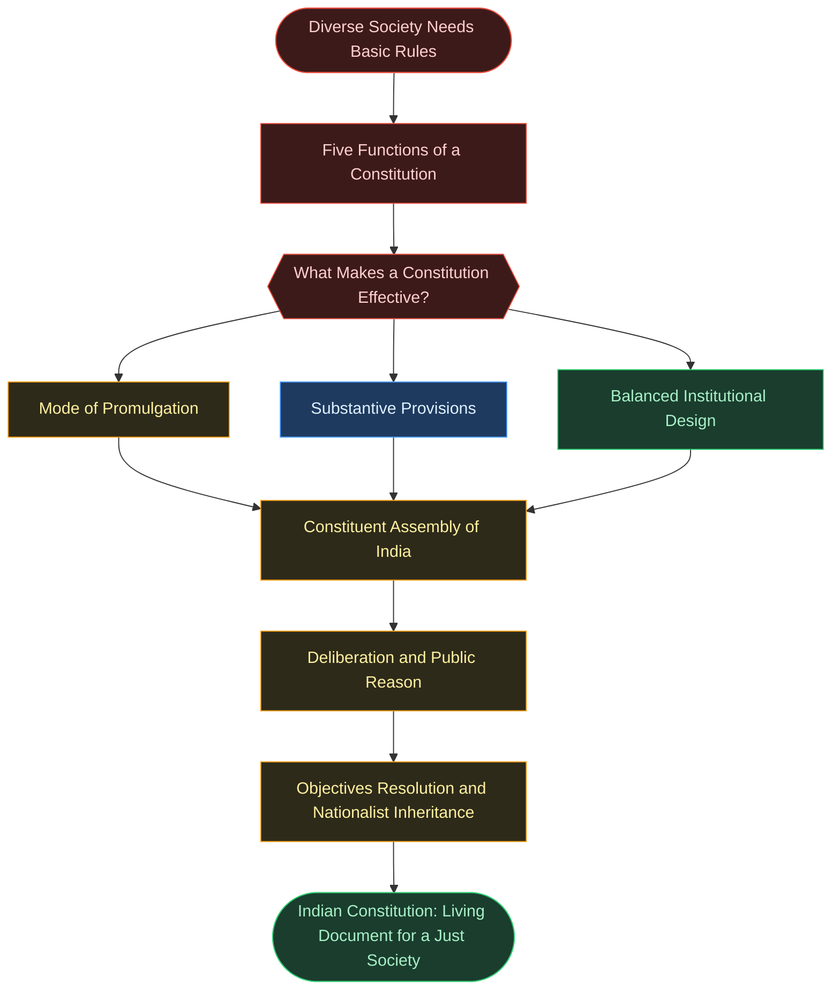
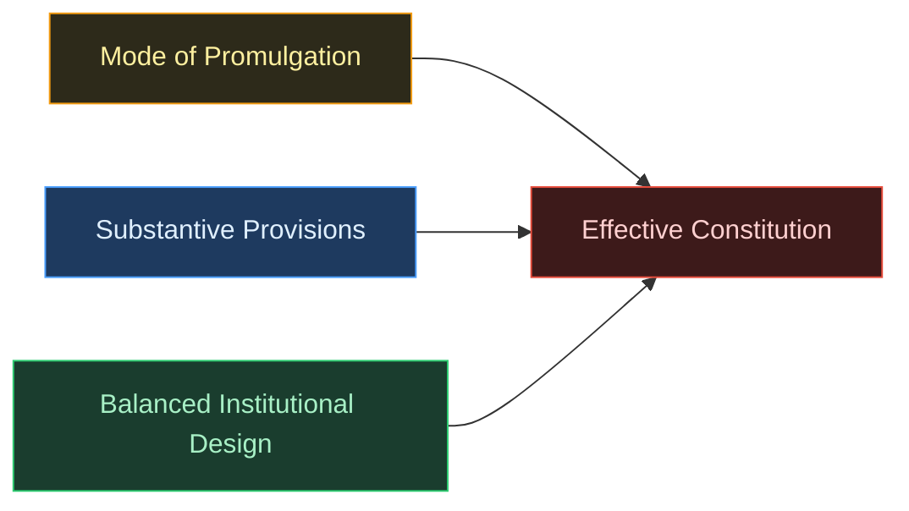

# Chapter 1: Constitution: Why and How?

**Subject:** Indian Constitution at Work · Class XI Political Science (NCERT)
**Board:** CBSE · Reprint 2026–27

---

## Learning Objectives

* What a constitution means
* What a constitution does to the society
* How constitutions govern the allocation of power in society
* What was the way in which the Constitution of India was made

---

## 🗺️ CONCEPT ROADMAP

---

## SECTION 1 — WHY DO WE NEED A CONSTITUTION?

### 1.1 Constitution Allows Coordination and Assurance ⭐

* A diverse society (different religions, professions, economic status, age) must live together despite differing interests and potential disputes over property, education, security, and discrimination — **coordination** is essential.
  * Without basic rules, individuals would be insecure: no one knows what others may do to them, or who can claim rights over what.
* Any group needs rules that are (a) **publicly promulgated** and known to all members, and (b) **legally enforceable** — without enforceability, citizens have no assurance others will follow the rules and therefore no reason to follow them either.
  * Saying rules are legally enforceable gives everyone assurance: if rules are violated, violators will be punished.

> [!important] NCERT Function 1 — Coordination and Assurance
> **The first function of a constitution is to provide a set of basic rules that allow for minimal coordination amongst members of a society.**

> [!abstract] Classroom Activity
> Enact the thought experiment from the chapter: the entire class collectively decides rules about how representatives are chosen, what decisions they can take on everyone's behalf, which decisions require full-class consultation, and how these rules can be revised.

> [!question] Read a Cartoon — European Constitution (p. 5)
> Countries of the European Union tried to create a European constitution — the attempt failed. Does conflict always accompany constitution making? What conditions make constitution-making a site of major disagreement between different groups?

### 1.2 Specification of Decision Making Powers ⭐

* A **constitution** is a body of fundamental principles according to which a state is constituted or governed; the most foundational question it must answer is: **who gets to decide** what the laws will be?
* Different constitutional systems give different answers:
  * **Monarchical constitution:** a monarch decides
  * Old **Soviet Union:** one single party was given the power to decide
  * **Democratic constitutions:** broadly speaking, the people decide
* Even in democracies, the "how" of people's decision-making must be specified: direct vote as the ancient **Greeks** practised, or through elected representatives? If through representatives: how are they elected? How many should there be?
* In the Indian Constitution: **Parliament** gets to decide laws and policies in most instances, and Parliament itself is organised in a specified manner.
  * A law that creates Parliament must logically precede Parliament itself — that law is the constitution; it is the authority that **constitutes government** in the first place.

> [!important] NCERT Function 2 — Decision-Making Power
> **The second function of a constitution is to specify who has the power to make decisions in a society. It decides how the government will be constituted.**

> [!question] Read a Cartoon — Nehru Balancing Different Visions (p. 7)
> The constitution makers had to address very different aspirations. Can you identify what the different groups depicted stand for? Who do you think prevailed in this balancing act during the making of India's Constitution?

### 1.3 Limitations on the Powers of Government ⭐

* Specifying decision-making power alone is insufficient: a government constituted through valid procedures could still pass patently unjust laws — prohibiting religious practice, discriminating by caste or skin colour, permitting arbitrary arrest, denying property to certain groups.
* The most common method of limiting government: specifying **fundamental rights** that all citizens possess and which no government may ever violate.
  * Basic cluster of protected rights: freedom from  **arbitrary arrest** ;  **freedom of speech, freedom of conscience, freedom of association, freedom to conduct a trade or business** .
* Rights can be limited during  **national emergency** ; the constitution specifies the exact circumstances under which these rights may be temporarily withdrawn.

> [!important] NCERT Function 3 — Limits on Government
> **So the third function of a constitution is to set some limits on what a government can impose on its citizens. These limits are fundamental in the sense that government may never trespass them.**

### 1.4 Aspirations and Goals of a Society ⭐

* Older constitutions largely limited themselves to allocating decision-making power and setting limits on government.
  * Many **20th-century constitutions** — of which the Indian Constitution is the finest example — additionally provide an **enabling framework** for government to pursue positive goals.
* Societies with deep entrenched inequalities (e.g., India's caste discrimination, South Africa's racial discrimination) must not only limit government but also empower it to take positive measures to overcome deprivation.
  * The Indian Constitution's framers believed every individual should have all that is necessary for a life of minimal dignity — minimum material well-being, education, etc.
* The **Preamble** supports these enabling provisions; they appear in the section on **Fundamental Rights** and in the **Directive Principles of State Policy** (DPSP), which enjoin the government to fulfil certain aspirations of the people.

> [!important] NCERT Function 4 — Enabling Aspirations
> **The fourth function of a constitution is to enable the government to fulfil the aspirations of a society and create conditions for a just society.**

> [!note] Enabling Provisions in Other Constitutions
> **South Africa:** The constitution assigns positive responsibilities to government — to promote conservation of nature, protect persons subjected to unfair discrimination, and progressively ensure adequate housing and health care for all.
> **Indonesia:** The constitution enjoins the government to establish and conduct a national education system; it ensures that poor and destitute children will be looked after by the government.

### 1.5 Fundamental Identity of a People

* A constitution expresses the **fundamental identity of a people** — this is the fifth function; NCERT discusses it as a conceptual point but does NOT give it a numbered bolded statement like Functions 1–4.
  * The people as a collective entity come into being *through* the basic constitution: by agreeing to basic norms about governance, one forms a  **collective political identity** .
* Constitutional norms are the overarching framework within which individuals pursue aspirations; the constitution defines fundamental values one may not trespass — this also gives citizens a  **moral identity** .
* **German** identity was constituted by being ethnically German; the Indian Constitution deliberately does **not** make ethnic identity a criterion for citizenship — a lesson drawn from the violence of Partition.
  * The relationship between regions and the central government (federal structure) also constitutes the **national identity** of a country.

> [!question] Read a Cartoon — Iraqi Constitution and Ethnic Conflict (p. 9)
> The writing of the new Iraqi constitution after the collapse of Saddam Hussain's regime saw conflict between different ethnic groups — Baghdadis, Shiites, Sunnis, Kurds. What do these different groups stand for? Compare the conflict depicted here with that depicted for the European Union and India.

### Check Your Progress

* The government cannot order any citizen to follow or not to follow any religion → **Limitations on the power of the government** (3rd function)
* The government must try to reduce inequalities in income and wealth → **Enabling the government to fulfil aspirations of a society** (4th function)
* The President has the power to appoint the Prime Minister → **Specification of decision-making powers** (2nd function)
* The Constitution is the supreme law that everyone has to obey → **Coordination and assurance** (1st function — enforceable supreme rule everyone must follow)
* Indian citizenship is not limited to people of any race, caste or religion → **Fundamental identity of a people** (5th function — India's national identity is civic, not ethnic)

---

## SECTION 2 — THE AUTHORITY OF A CONSTITUTION

> [!info] What Is a Constitution?
> In most countries, a constitution is a compact document comprising articles about the state — specifying how it is constituted and what norms it should follow. In some countries, however — the **United Kingdom** being the prime example — there is no single document; instead, a series of documents and decisions taken collectively are referred to as the constitution. Therefore: a constitution is the document or **set of documents** that seeks to perform the functions outlined in Section 1.

The section raises three further questions: (a) What is a constitution? (b) How effective is a constitution? (c) Is a constitution just? Constitutional effectiveness depends on three factors:  **mode of promulgation** ,  **substantive provisions** , and  **balanced institutional design** .

### 2.1 Mode of Promulgation ⭐

* **Mode of promulgation** refers to how a constitution comes into being — who crafted it and how much authority those persons had over the people they governed.
  * In many countries, constitutions remain defunct because they are crafted by **military leaders** or unpopular leaders who cannot carry the people with them.
* The most successful constitutions (India, South Africa, United States) were created in the aftermath of  **popular national movements** .
* India's Constitution was formally created by a Constituent Assembly between [December 1946] and [November 1949]; it drew upon a long history of the nationalist movement that had the remarkable ability to carry different sections of Indian society together.
  * Drafted by people with immense **public credibility** who could negotiate and command the respect of a wide cross-section of society — and who convinced people the constitution was not an instrument for aggrandisement of personal power.
  * The final document reflected the **broad national consensus** at the time.
* The Indian Constitution was  **never subjected to a referendum** , but nevertheless carried enormous public authority because it had the consensus and backing of leaders who were themselves popular; people adopted it as their own by abiding by its provisions.

> [!example] Case Study — Nepal's Constitution Making
> Nepal had five constitutions (1948, 1951, 1959, 1962, 1990) — all 'granted' by the King, none emerging from popular participation. The 1990 constitution introduced multiparty competition but the King retained final powers. After years of political agitation led principally by the Communist Party of Nepal (Maoist), the King was stripped of powers. In [2008] Nepal became a democratic republic after abolishing the monarchy, and finally adopted a new constitution through popular participation in [2015].

### 2.2 The Substantive Provisions of a Constitution

* A successful constitution must give **everyone** in society some reason to go along with its provisions.
  * A constitution allowing permanent majorities to oppress minorities will give those minorities no reason to abide by it; one entrenching the power of small groups will cease to command allegiance from the rest.
* No constitution achieves perfect justice by itself; but it must convince people it provides the  **framework for pursuing basic justice** .
* Key principle: the more a constitution preserves the **freedom and equality** of all its members, the more likely it is to succeed.

### 2.3 Balanced Institutional Design ⭐

* Constitutions are often subverted not by the people at large but by **small groups** seeking to enhance their own power.
  * Well-crafted constitutions fragment power **intelligently** so that no single group can subvert the constitution.
* Indian Constitution: power **horizontally fragmented** across the Legislature, Executive, Judiciary, and independent statutory bodies like the **Election Commission** — if one institution wants to subvert the Constitution, others can check its transgressions.
* A constitution must also balance **rigidity** with  **flexibility** :
  * Too rigid → likely to break under the weight of change
  * Too flexible → gives no security, predictability, or identity to a people
* The Indian Constitution is described as a **'living document'** (see Chapter 9): by striking a balance between the possibility of amendment and limits on such changes, it has survived as a document respected by the people.

> [!important] Checks and Balances
> An intelligent system of checks and balances has facilitated the success of the Indian Constitution. Power is fragmented across Legislature, Executive, Judiciary, and Election Commission — no single institution can acquire a monopoly of power, and any institution attempting to subvert the Constitution can be checked by the others.

> [!question] Read a Cartoon — Castle of Cards (p. 14)
> Why does the cartoonist describe the new Iraqi Constitution as a castle of cards? Would this description apply to the Indian Constitution? What features — public credibility of framers, balanced institutional design, inheritance from the nationalist movement — distinguish the Indian experience?

### 2.4 How Was the Indian Constitution Made?

* Formally made by the **Constituent Assembly** elected for undivided India.
  * First sitting: **[9 December 1946]**
  * Reassembled as Constituent Assembly for divided India: **[14 August 1947]**
* Members chosen by **indirect election** by members of the Provincial Legislative Assemblies (established under the  **Government of India Act, 1935** ).
* Composed roughly along the lines of the **Cabinet Mission** plan — a committee of the British cabinet.

| Cabinet Mission Plan            | Details                                                                                                                     |
| :------------------------------ | :-------------------------------------------------------------------------------------------------------------------------- |
| Seat allocation ratio           | 1 : 10,00,000 (approximately 1 seat per 10 lakh population)                                                                 |
| Provinces (direct British rule) | To elect**292 members**                                                                                               |
| Princely States                 | Allotted a minimum of**93 seats**                                                                                     |
| Community distribution          | Seats in each Province distributed among**Muslims, Sikhs, and general**communities in proportion to their populations |
| Election method                 | Proportional representation with**single transferable vote**                                                          |
| Princely State representatives  | Method of selection by**consultation**                                                                                |

#### 2.4.1 Composition of the Constituent Assembly ⭐

* After Partition (under the plan of  **[3 June 1947]** ), members from territories that fell under Pakistan ceased to be members → total  **reduced to 299 members** .
* Constitution **adopted: [26 November 1949]** (now observed as Constitution Day).
  * **284 members** actually present on **[24 January 1950]** appended their signatures to the Constitution as finally passed.
* Constitution **came into force: [26 January 1950]** (Republic Day).
* The Constitution was framed against the backdrop of Partition's horrendous violence — yet framers learnt the right lessons and committed to a new conception of citizenship:  **religious identity would have no bearing on citizenship rights** .
* Representation: all religions included;  **28 members from Scheduled Castes** ; **Congress** dominated with **82%** of seats after Partition — and the Congress itself was diverse enough to accommodate almost all shades of opinion.

#### 2.4.2 The Principle of Deliberation ⭐

* The CA's authority came not only from its representativeness, but from the **procedures it adopted** and the values its members brought to their deliberations.
  * Members deliberated with the interests of the **whole nation** in mind; few disagreements could be traced to members protecting their own narrow interests.
* Legitimate differences of principle were wide-ranging: centralised vs decentralised government, Centre–State relations, powers of the judiciary, protection of property rights — all seriously discussed and debated.
  * The only provision passed without virtually any debate: the introduction of **universal suffrage** (all citizens at voting age entitled to vote irrespective of religion, caste, education, gender, or income) — so self-evidently correct that no argument was deemed necessary.
* The CA engaged in  **public reason** : members gave principled reasons to other members rather than merely asserting self-interest; the very act of giving principled reasons moves deliberation beyond narrow self-interest toward the common good.

> [!quote] Dr. B.R. Ambedkar — Social Democracy, 25 November 1949
> *"We must make our political democracy a social democracy as well. Political democracy cannot last unless there lies at the base of it social democracy. What does social democracy mean? It means a way of life, which recognises liberty, equality and fraternity as the principles of life. These principles of liberty, equality and fraternity are not to be treated as separate items in a trinity. They form a union of trinity in the sense that to divorce one from the other is to defeat the very purpose of democracy. Liberty cannot be divorced from equality, equality cannot be divorced from liberty. Nor can liberty and equality be divorced from fraternity. Without equality, liberty would produce the supremacy of the few over the many. Equality without liberty would kill individual initiative. Without fraternity, liberty and equality could not become a natural course of things…"*
> — Dr. B.R. Ambedkar, CAD, Vol. XI, p.979, 25 November 1949

#### 2.4.3 Procedures

* The CA had **eight major Committees** on different subjects, usually chaired by  **Jawaharlal Nehru, Rajendra Prasad, Sardar Patel, or B.R. Ambedkar** .
  * Ambedkar had been a bitter critic of Congress and Gandhi, accusing them of insufficient effort for the upliftment of Scheduled Castes; Patel and Nehru disagreed on many issues — yet all worked together in the Assembly.
* Each Committee drafted particular provisions of the Constitution → subjected to debate by the  **entire Assembly** ; the aim was consensus so that provisions agreed to by all would not be detrimental to any particular interests; some provisions were subject to a vote.
  * Every argument, query, or concern was responded to  **in writing** .
* The Assembly met for **166 days** spread over  **2 years and 11 months** ; sessions were open to the **press and the public** alike.

> [!question] Read a Cartoon — Rajendra Prasad and Ambedkar (p. 18)
> Dr. Rajendra Prasad, President of the Constituent Assembly, greets Dr. B.R. Ambedkar, Chairman of the Drafting Committee. What does Rajendra Prasad's tribute to the Drafting Committee tell us about the collaborative working culture of the Constituent Assembly, particularly given the well-known differences in political views among its key leaders?

> [!quote] Dr. Rajendra Prasad — Tribute to the Drafting Committee, 26 November 1949
> *"I have realised as nobody else could have, with what zeal and devotion the members of the Drafting Committee and especially its Chairman, Dr. Ambedkar in spite of his indifferent health, have worked. We could never make a decision which was or could be ever so right as when we put him on the Drafting Committee and made him its Chairman. He has not only justified his selection but has added lustre to the work which he has done. In this connection, it would be invidious to make any distinction as among the other members of the Committee. I know they have all worked with the same zeal and devotion as its Chairman, and they deserve the thanks of the country."*
> — Dr. Rajendra Prasad, CAD, Vol. XI, p.994, 26 November 1949

#### 2.4.4 Inheritance of the Nationalist Movement ⭐

* No constitution is simply a product of the Assembly that produces it — a background consensus on main principles is needed first; the Indian CA could not have functioned without the consensus built through decades of the freedom struggle.
  * The CA gave concrete shape and form to the principles it had **inherited from the nationalist movement** — questions debated for decades: what form of government India should have, what values to uphold, what inequalities to overcome.
* Best summary of these principles: the **Objectives Resolution** moved by Nehru in **1946** — it encapsulated the aspirations and values behind the Constitution.
  * Based on it, the Constitution gave institutional expression to:  **equality, liberty, democracy, sovereignty, and a cosmopolitan identity** .
  * Thus, the Constitution is not merely a maze of rules and procedures — it is a **moral commitment** to fulfil the promises held before the people by the nationalist movement.

> [!important] Main Points of the Objectives Resolution (1946)
>
> 1. India is an independent, sovereign, republic.
> 2. India shall be a Union of erstwhile British Indian territories, Indian States, and other parts outside willing to be a part of the Union.
> 3. Territories forming the Union shall be autonomous units and exercise all powers and functions of the Government except those assigned to or vested in the Union.
> 4. All powers and authority of sovereign India and its constitution shall flow from the people.
> 5. All people of India shall be guaranteed social, economic and political justice; equality of status and opportunities; equality before law; and fundamental freedoms — of speech, expression, belief, faith, worship, vocation, association and action — subject to law and public morality.
> 6. The minorities, backward and tribal areas, depressed and other backward classes shall be provided adequate safeguards.
> 7. The territorial integrity of the Republic and its sovereign rights on land, sea and air shall be maintained according to justice and law of civilised nations.
> 8. The land would make full and willing contribution to the promotion of world peace and welfare of mankind.

#### 2.4.5 Institutional Arrangements ⭐

* The CA spent extensive time balancing the institutions of **executive, legislature, and judiciary** — leading to the adoption of the **parliamentary form of government** and the  **federal arrangement** .
  * Parliamentary form: power balanced between legislature and executive.
  * Federal arrangement: power distributed between the Centre and the States.
* Framers were not averse to borrowing from other constitutional traditions — but each provision had to be  **defended on grounds of its suitability to Indian problems and aspirations** ; borrowing was not slavish imitation.
  * It is a testament to the framers' wide learning that they could lay their hands upon any intellectual argument or historical example needed for the task.

> [!quote] Dr. B.R. Ambedkar — On Novelty in Constitution-Making, 4 November 1948
> *"One likes to ask whether there can be anything new in a Constitution framed at this hour in the history of the world… The only new things, if there can be any, in a Constitution framed so late in the day are the variations made to remove the faults and to accommodate it to the needs of the country."*
> — Dr. B.R. Ambedkar, CAD, Vol. VII, p.37, 4 November 1948

> [!note] Provisions Borrowed from Other Constitutions
> Each provision was deliberately adapted to Indian conditions — the framers took the best available in the world and made it their own. This process of selective and purposive borrowing reflects breadth of learning, not lack of originality.

| Provision Borrowed                                                               | Source Country |
| :------------------------------------------------------------------------------- | :------------: |
| First Past the Post electoral system                                             |    Britain    |
| Parliamentary Form of Government                                                 |    Britain    |
| The idea of Rule of Law                                                          |    Britain    |
| Institution of the Speaker and her/his role                                      |    Britain    |
| Law-making procedure                                                             |    Britain    |
| Charter of Fundamental Rights                                                    | United States |
| Power of Judicial Review                                                         | United States |
| Independence of the Judiciary                                                    | United States |
| Directive Principles of State Policy                                             |    Ireland    |
| Principles of Liberty, Equality and Fraternity                                   |     France     |
| Quasi-federal form of government (federal system with strong central government) |     Canada     |
| Idea of Residual Powers                                                          |     Canada     |

---

## Exercise Answers

### Multiple Choice Questions

**Q 1.** **Answer: (c)** — "It ensures that good people come to power" is NOT a function of the constitution. The constitution sets rules and frameworks for governance, limits power, and expresses values — but who comes to power depends on electoral processes and the character of candidates, not on the constitution itself. Options (a), (b), and (d) are all genuine constitutional functions (3rd, 2nd, and 5th functions respectively).

**Q 2.** **Answer: (c)** — "The constitution specifies how parliament is to be formed and what its powers are" is the best reason. Parliament derives its very existence and authority from the constitution; the constitution is logically and legally prior to Parliament. Option (a) (temporal precedence) does not establish superior authority. Option (b) (eminence of framers) is irrelevant to legal authority. Option (d) is factually incorrect — Parliament can amend the constitution, though with limitations.

### True / False

**Q 3a. False** — Not all constitutions are single written documents. The United Kingdom has no single document called the Constitution; it has a series of documents and decisions taken collectively. Additionally, constitutions do more than cover the formation and power of the government — they express fundamental values and collective identity.

**Q 3b. False** — Constitutions exist in and are required by states that are not democratic. The chapter explicitly cites the old Soviet Union (a one-party state) and monarchical constitutions as examples of constitutional systems; these are not democratic yet have constitutions.

**Q 3c. False** — A constitution is not a purely legal document devoid of ideals and values. The chapter explicitly describes the Indian Constitution as a "moral commitment" to establish a just government; it expresses fundamental values, aspirations (Preamble, DPSP), and the collective identity of the people.

**Q 3d. True** — A constitution gives citizens a new identity — a collective political identity formed by agreeing to a shared set of constitutional norms, and a moral identity defined by the fundamental values the constitution upholds. The chapter states this explicitly in the discussion of the fifth function.

### Correct or Incorrect — Making of the Indian Constitution (Q 4)

**Q 4a. Incorrect** (with nuance)

* Members were not elected by universal suffrage, but serious attempts were made at representativeness: all religions received representation, 28 members were from Scheduled Castes, and the Congress — which held 82% of seats — was itself diverse enough to accommodate all shades of opinion.
* Constitutional authority also depends on the public credibility of those who enact it, not merely on their electoral mandate; India's framers had immense popular credibility earned through the freedom struggle.
* The people adopted the Constitution as their own by abiding by its provisions — this itself is a form of democratic consent.

**Q 4b. Incorrect**

* The CA involved extensive and serious debate on many major decisions: centralised vs decentralised government, Centre–State relations, powers of the judiciary, protection of property rights — virtually every issue at the foundation of a modern state was debated.
* The only provision passed without virtually any debate was universal suffrage — because it was self-evidently correct and required no argument.
* The Assembly met for 166 days across 2 years and 11 months, with every argument and concern responded to in writing — this demonstrates the scale and seriousness of the decisions involved.

**Q 4c. Incorrect**

* Borrowing from other constitutions was NOT slavish imitation; each provision had to be defended on grounds of its specific suitability to Indian problems and aspirations.
* As Ambedkar himself noted, the originality of any constitution framed at this stage of history lies in the variations made to remove faults and accommodate the country's unique needs.
* India was fortunate to have a Constituent Assembly that, instead of being parochial, could take the best available in the world and make it their own — this reflects remarkable intellectual breadth and adaptability, not a lack of originality.

### Examples to Support Conclusions (Q 5)

**Q 5a.** Constitution made by credible leaders:

* Ambedkar (Chairman of the Drafting Committee) was a globally respected jurist and the foremost champion of Scheduled Castes — his inclusion itself signalled commitment to inclusive constitution-making despite his known differences with the Congress.
* Nehru (who moved the Objectives Resolution), Rajendra Prasad (President of the CA), and Sardar Patel had all led the nationalist movement, commanding popular respect earned over decades; the CA held open sessions and responded to every concern in writing, demonstrating public accountability.

**Q 5b.** Constitution distributes power to make subversion difficult:

* Power is horizontally fragmented: Legislature, Executive, Judiciary, and Election Commission each check the others — no single institution can acquire a monopoly of power or subvert the Constitution without the others checking it.
* Power is vertically distributed through the federal arrangement between the Centre and the States; additionally, the parliamentary system balances executive and legislative authority within the Centre itself.

**Q 5c.** Constitution is the locus of hopes and aspirations:

* The Objectives Resolution (1946) enshrined equality, liberty, democracy, sovereignty, and cosmopolitan identity — the Constitution is explicitly described as a "moral commitment" to fulfil the promises the nationalist movement held before the people.
* The Preamble expresses the ideals of the people; Fundamental Rights protect every citizen; and Directive Principles of State Policy guide the state toward social and economic justice — together these express the aspirations of the people of India.

### Short Answer Questions

**Q 6.** Why is demarcation of powers necessary?

* Without clear demarcation, different organs of government could claim the same authority → conflicts, deadlock, and legal uncertainty about who has the right to act in any given situation.
* Citizens would have no recourse because if no one knows who is responsible for a function, rights cannot be enforced against any specific authority.
* In the absence of demarcation, power would tend to concentrate in one institution or person — enabling tyranny; India's distribution of law-making power to Parliament, implementation to the Executive, and interpretation to the Judiciary prevents this.

**Q 7.** Why are limitations on rulers necessary?

* Even governments constituted through legitimate procedures can pass patently unjust laws; the chapter gives examples such as prohibiting religious practice, permitting arbitrary arrest, or discriminating by caste or skin colour — power is susceptible to abuse without enforceable limits.
* Constitutions protect a basic cluster of rights (speech, conscience, association, trade) because history demonstrates that governments without limits tend to serve the few at the cost of the many.
* A constitution that gives no power at all to citizens would be fundamentally unjust — citizens would have no reason to go along with it, causing it to lose allegiance and become effective only on paper.

### Long Answer Questions

**Q 8.** Japanese Constitution under US occupation vs Indian experience:

Problem with the Japanese constitution-making:

* Made under the control of the US occupation army — no provision could be included that the US government did not approve; this violates the core principle of mode of promulgation.
* The framers lacked independent public credibility with the Japanese people; citizens could not be convinced that the constitution was not an instrument serving external interests rather than their own aspirations.
* Authority of a constitution depends on whether its framers were credible, could carry the people with them, and reflected broad national consensus — the Japanese situation satisfied none of these conditions at the time of drafting.

How the Indian experience was different:

* India's Constitution emerged from a long nationalist movement with broad popular support across all sections of society — its drafters had earned credibility through decades of the freedom struggle.
* CA members were chosen through indirect election by Provincial Legislative Assemblies — not imposed from outside; the process was internally generated.
* Leaders (Ambedkar, Nehru, Prasad, Patel) commanded immense public respect; the CA deliberated for 166 days in open sessions, with every concern responded to in writing — the people could see and trust the process.
* The final document reflected broad national consensus, and the people adopted it as their own by abiding by its provisions.

**Q 9.** Answering Rajat's challenge:

On the constitution being "outdated":

* The Indian Constitution is a 'living document' — it can be amended and has been amended well over a hundred times since 1950 to remain relevant to changing circumstances, while preserving its core values.
* The balance between amendability and limits on amendment is itself a mark of wisdom: too rigid a constitution would already have collapsed; too flexible a one would offer no identity or security.

On individual consent not being taken:

* Democratic legitimacy does not require individual consent at birth; it requires collective agreement through representatives at the time of founding, and continuing consent demonstrated through participation in elections, use of courts to enforce rights, and daily reliance on constitutional governance.
* Subsequent generations demonstrate implicit consent by participating in the constitutional democracy — voting, contesting elections, seeking judicial remedies.

On language being difficult:

* The Constitution sets principles and frameworks; its application through thousands of court judgments has generated accessible legal language; its spirit — rights, representation, rule of law — is embedded in everyday life.

On why one should obey it:

* The Constitution gives Rajat his rights: to vote, to speak freely, to practise religion, not to be arrested without cause, to seek judicial redress; these protections come from the Constitution.
* Refusing to recognise the Constitution would mean surrendering the very rights that protect all citizens from arbitrary power — the Constitution is in Rajat's own interest.

**Q 10.** Evaluating three positions on the Constitution's success:

Harbans (Constitution succeeded in giving a democratic framework): Largely correct — India has held multiple general elections, witnessed peaceful transfers of power, maintained an independent judiciary, free press, and functioning federal arrangement; the constitutional framework has proven durable and real.

Neha (Constitution failed because liberty, equality, fraternity not yet achieved): Overstated, though not entirely without validity — the Constitution sets up a framework for pursuing these goals, not a guarantee of their instant achievement; judging the document by whether its aspirations are fully realised conflates the framework with those who implement it.

Nazima (We have failed the Constitution, not vice versa): Most nuanced — the Constitution provides the tools and the framework; how those tools are used depends on citizens, governments, courts, and political will. Where inequality and injustice persist, this reflects failures of implementation, not failures of the constitutional framework itself.

Most defensible position: A combination of Harbans and Nazima — the Constitution has genuinely succeeded in establishing a democratic framework that has proven far more durable than most post-colonial constitutions, but fully achieving its aspirations of liberty, equality, and fraternity requires citizens and governments to consistently live up to their constitutional obligations.

---

## ⚠️ Common Exam Traps

> [!warning] Trap — UK Has No Written Constitution
> Students often assume ALL constitutions are single written documents. The United Kingdom has no single document called the Constitution — it has a series of documents and decisions taken collectively. This distinction is directly examined in Q 3a of this chapter's exercises. The correct answer is that the constitution is the "document or set of documents" that performs the five functions.

> [!warning] Trap — Adoption Date vs Commencement Date
> The Constitution was **adopted on [26 November 1949]** (observed as Constitution Day) but **came into force on [26 January 1950]** (Republic Day). Students routinely swap these two dates in short-answer questions. The 284-member signing event was **[24 January 1950]** — also distinct from both. Adoption ≠ signing ≠ commencement.

> [!warning] Trap — Borrowed = Unoriginal
> Students incorrectly infer that because the Indian Constitution borrowed provisions from five other countries, it lacks originality. The chapter explicitly states borrowing was NOT slavish imitation — each provision had to be defended on grounds of its specific suitability to Indian conditions. Ambedkar himself addressed this: originality lies in the variations made to accommodate the country's needs. Describing the Constitution as "borrowed" without this qualification will lose marks.

---

## 📝 PYQ Connections

> [!tip] Pattern — Functions of a Constitution (Highest Frequency)
> "Explain any four functions of a constitution" or "Why do we need a constitution?" appears in almost every CBSE board session. Expected as a **4-mark or 6-mark** question. Answer must include all four formally stated NCERT functions with brief explanation of each. Using the verbatim NCERT function statements (boldened in the chapter) scores full marks. Note: the fifth function (collective identity) is a valid addition but is NOT formally numbered by NCERT.

> [!tip] Pattern — Making of the Indian Constitution
> "How was the Indian Constitution made? Discuss the role of the Constituent Assembly." This recurring **6-mark long-answer** question expects: CA composition and key dates, Cabinet Mission plan, Principle of Deliberation and public reason, inheritance from the nationalist movement (Objectives Resolution), and borrowed provisions. All five sub-topics together constitute a full answer.

> [!tip] Pattern — Objectives Resolution
> "What were the main features/points of the Objectives Resolution?" or "How did the Objectives Resolution shape the Indian Constitution?" Expected as a  **4-mark question** . List the 8 points (or 4–5 key ones) and link them to specific constitutional features: sovereignty → Preamble; fundamental freedoms → Fundamental Rights; minority safeguards → constitutional protections; world peace → foreign policy orientation.

---

## 🔑 Quick Concept Reference

| Concept                             | Core Idea                                                                                      | Article / Source |
| :---------------------------------- | :--------------------------------------------------------------------------------------------- | :--------------: |
| Function 1 — Coordination          | Provides basic rules for minimal coordination amongst members of a society                     |    NCERT p.3    |
| Function 2 — Decision-Making Power | Specifies who has authority to make decisions; decides how government is constituted           |    NCERT p.5    |
| Function 3 — Limits on Government  | Sets fundamental limits on what government can impose on citizens; never to be trespassed      |    NCERT p.6    |
| Function 4 — Enabling Aspirations  | Enables government to fulfil society's aspirations and create conditions for a just society    |    NCERT p.8    |
| Function 5 — Collective Identity   | Expresses fundamental political, moral, and national identity of a people                      |  NCERT pp.8–9  |
| Three Factors for Effectiveness     | Mode of promulgation + Substantive provisions + Balanced institutional design                  | NCERT pp.11–14 |
| Constituent Assembly — Key Facts   | First sitting [9 Dec 1946]; 299 members post-Partition; met 166 days; open sessions            | NCERT pp.15–19 |
| Cabinet Mission Plan                | Ratio 1:10,00,000; Provinces: 292 seats; Princely States: min 93; 3 communities                |    NCERT p.15    |
| Objectives Resolution               | Moved by Nehru in 1946; 8 main points; basis for the Constitution's moral commitment           | NCERT pp.19–20 |
| Borrowed Provisions                 | Adapted from 5 countries; NOT slavish imitation; each provision defended for Indian conditions | NCERT pp.21–22 |