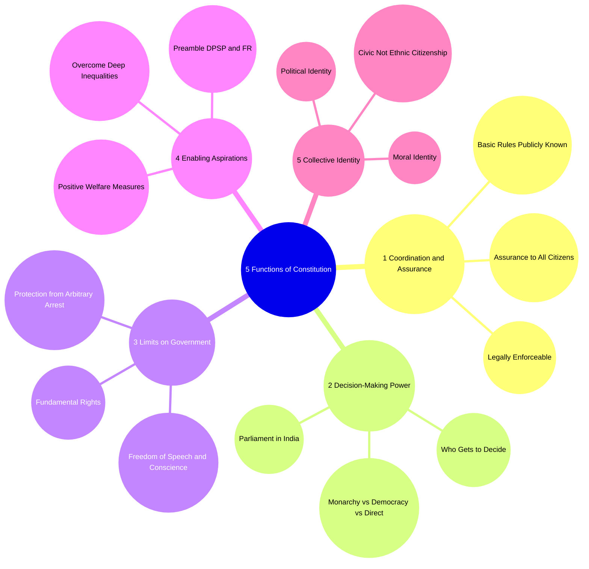
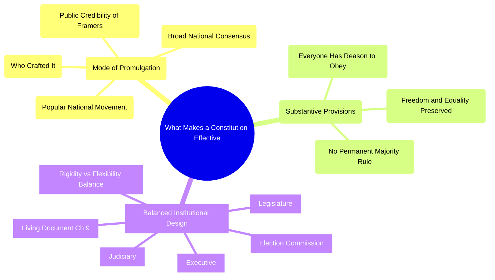
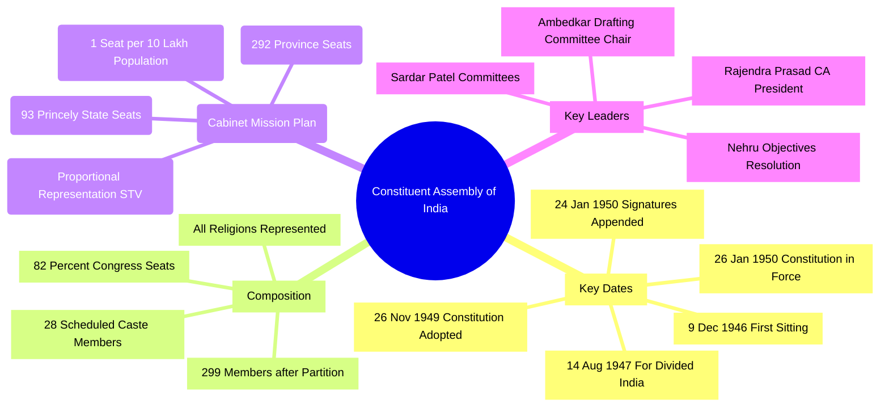
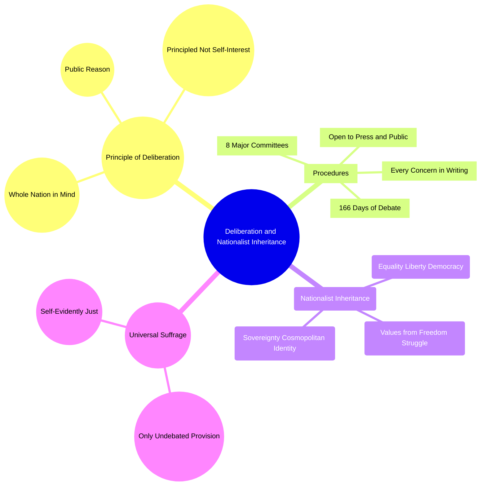
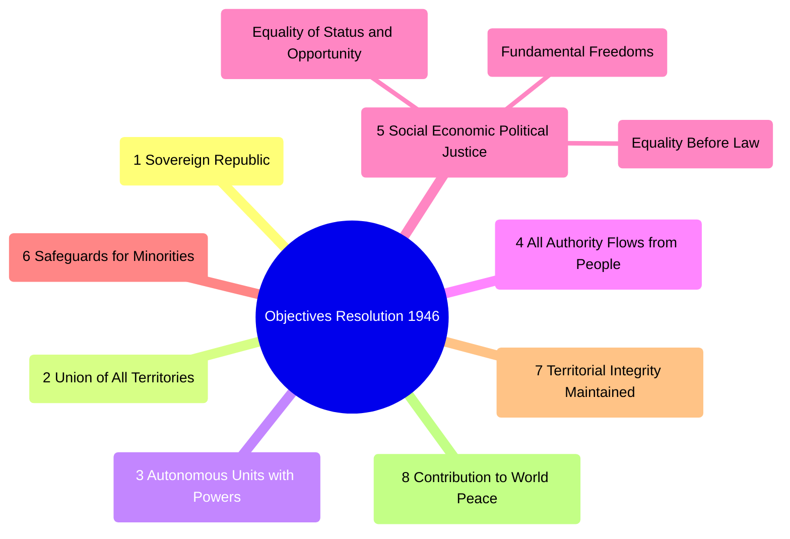
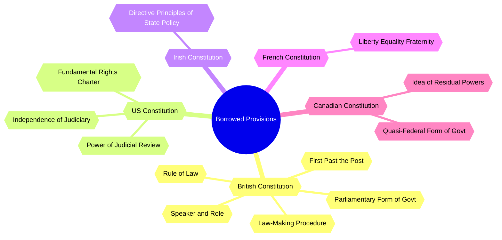

# Chapter 1: Constitution: Why and How? — Revision MindMaps
**Subject:** Indian Constitution at Work · Class XI Political Science (NCERT)

> 🧠 Render with: Obsidian (Mermaid plugin) · Logseq · VS Code + Mermaid extension
> 📌 Six focused mini-maps — use each independently for targeted revision
> 🗺️ For logical reading flow, see the Concept Roadmap in `CH01_ConstitutionWhyHow_Notes.md`

---

## 🗺️ Map 1 — Five Functions of a Constitution
> **Use for:** "Explain any four functions of a constitution" — the most frequently tested question in CBSE boards.

> **⭐ Exam note:** Functions 1–4 have verbatim bolded NCERT statements — memorise them exactly. Function 5 (collective identity) has NO bolded statement; present it as a conceptual point only.

---

## 🗺️ Map 2 — What Makes a Constitution Effective?
> **Use for:** "What are the factors that make a constitution effective?" — 4-mark or 6-mark question.

> **⭐ Exam note:** Nepal is the case study for *failed* mode of promulgation (5 constitutions granted by King). India, South Africa, and the US are the success examples.

---

## 🗺️ Map 3 — The Constituent Assembly
> **Use for:** Short-answer questions on CA composition, dates, and numbers — all are frequently tested.

> **⭐ Exam note:** The single most common error — confusing **adopted date [26 Nov 1949]** with **in-force date [26 Jan 1950]**. The 284-member signing was [24 Jan 1950] — a third distinct date.

---

## 🗺️ Map 4 — Deliberation and Nationalist Inheritance
> **Use for:** "How did the Constituent Assembly acquire its authority?" — part of the 6-mark question on how the Constitution was made.

> **⭐ Exam note:** Universal suffrage was the **only** provision passed without debate — all other issues were seriously argued. This fact is specifically asked in some papers.

---

## 🗺️ Map 5 — The Objectives Resolution (1946)
> **Use for:** "What are the main features/points of the Objectives Resolution?" — standard 4-mark question.

> **⭐ Exam note:** Moved by **Jawaharlal Nehru** in **1946**. The 8 points became the Constitution's moral foundation — not just a procedural document. For a 4-mark answer, points 4, 5, 6, and 8 are the most commonly expected.

---

## 🗺️ Map 6 — Provisions Borrowed from Other Constitutions
> **Use for:** "Name the provisions borrowed from different countries" — frequent matching or table-format question. Most misidentified: DPSP is from **Ireland**, not the US.

> **⭐ Exam note:** Borrowing was **NOT slavish imitation** — every provision was defended on grounds of suitability to Indian conditions. Ambedkar himself addressed this in CAD, Vol. VII (4 Nov 1948).

---

## 🔗 Connect-the-Dots Insights

> [!note] Maps 3 + 1 — Historical Moment Shaped Constitutional Design
> The violence of Partition ([1947]) directly explains the Constitution's decision to define citizenship as **civic not ethnic** (Map 1: collective identity) — deliberately rejecting the German ethnic model. The historical urgency of 1947 (Map 3: composition) shaped the institutional design of 1949–50. Minority safeguards in the Objectives Resolution (Map 5: Point 6) are the direct constitutional response to communal violence.

> [!note] Maps 1 + 2 — All Five Functions Feed into Effectiveness
> A constitution that fulfils only some functions will lose allegiance from disadvantaged groups. Function 3 (limits on government) prevents Function 2 (decision-making power) from becoming tyranny. Function 4 (enabling aspirations) gives positive direction beyond restraint. Without Function 5 (collective identity), citizens have no reason to feel bound by any of the rest. Ambedkar's "union of trinity" — liberty, equality, fraternity — expresses exactly this interdependence across Maps 1 and 4.

> [!note] Maps 4 + 6 — Deliberation Made Borrowing Legitimate
> The Principle of Deliberation (Map 4) is what transformed borrowed provisions (Map 6) from a weakness into a strength. Because every imported provision was publicly reasoned about in open CA sessions and defended on grounds of its fitness for India, the borrowing itself generated constitutional legitimacy. The Constitution's authority comes from this transparent reasoning — visible to press and public — not merely from its indirect electoral mandate.

---

## ⭐ Exam-Hot Nodes

- **Five Functions of a Constitution** — Required in virtually every CBSE paper; "explain any four functions" as a 4-mark or 6-mark question
- **Key CA dates** (9 Dec 1946 / 26 Nov 1949 / 26 Jan 1950) — Tested in 1-mark and short-answer; adoption vs commencement distinction is a favourite trap
- **Borrowed Provisions from five countries** — Matching or table-format question; most misidentified pair is DPSP (Ireland, not USA) and Liberty-Equality-Fraternity (France, not Britain)
- **Universal suffrage as the only undebated provision** — Specific fact tested to check depth of knowledge about the Principle of Deliberation
- **Objectives Resolution — Points 4, 5, and 6** — The three points most asked about in "features of OR" questions